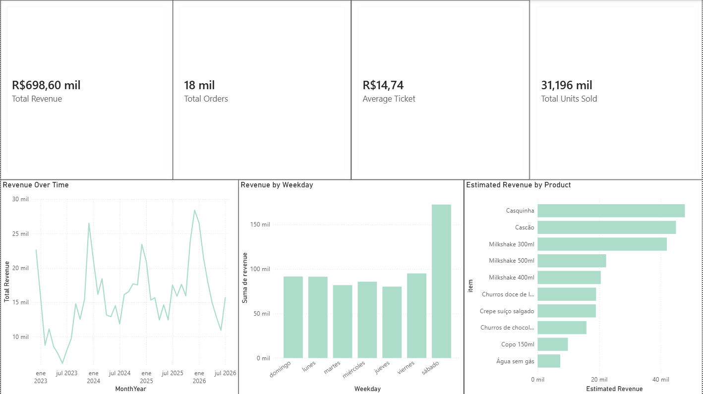
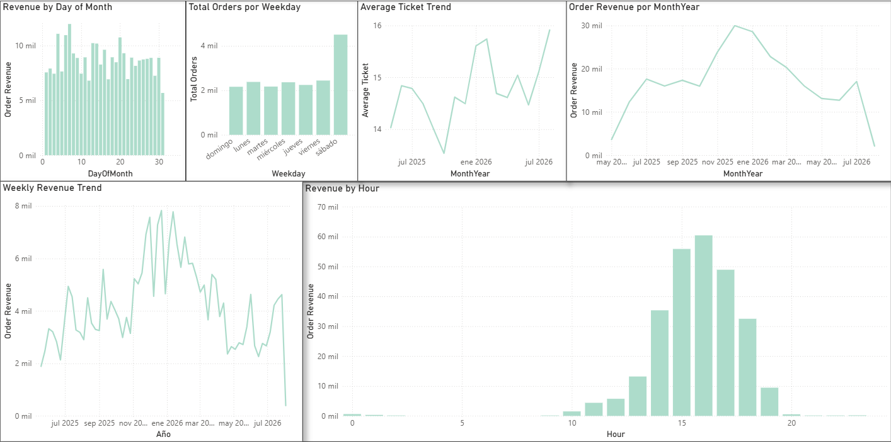
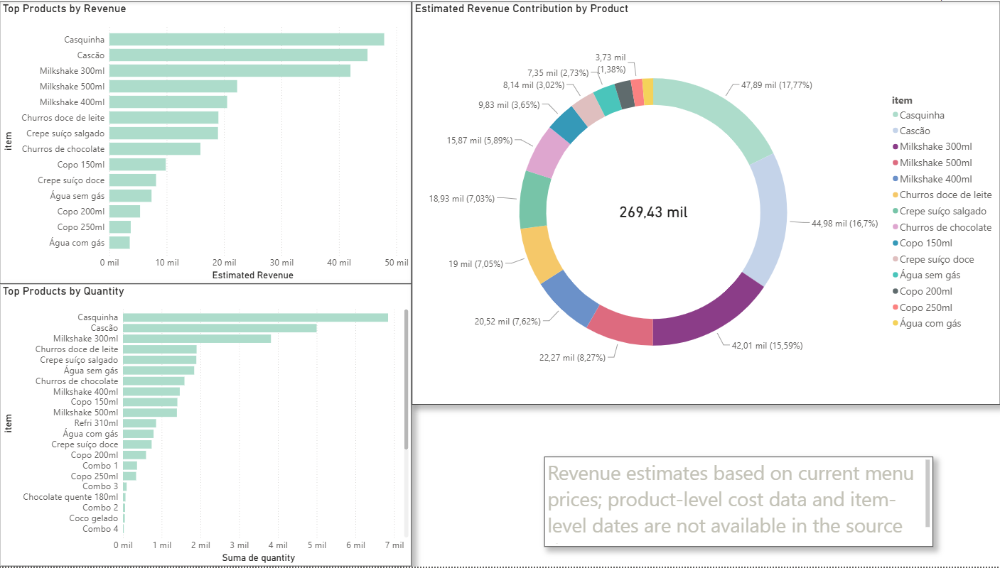

# 🚚 Food Truck Sales Analysis

End-to-end data analysis project using real sales data from my own food truck business — from raw data cleaning and transformation to SQL analysis, data visualization, and actionable business insights.

The project follows a real-world Data Analyst workflow focused on understanding sales performance, identifying patterns, and supporting data-driven business decisions.

---

## 📌 Objective

The objective of this project is to analyze historical food truck sales data to understand **when sales happen, which products drive revenue, and how sales performance changes over time**.

The analysis combines Python, SQL, and Power BI to transform raw operational data into meaningful business insights and recommendations.

---

## ❓ Business Questions

The analysis focuses on the following business questions:

- Which days of the week generate the highest revenue?
- Which hours generate the highest and lowest revenue?
- Is there a clear growth, decline, or seasonal pattern in revenue?
- How does the average ticket change over time?
- Is there a difference between the products with the highest sales volume and those generating the most revenue?
- How concentrated is revenue among the top-selling products?
- Are there recurring patterns throughout the month that could support operational decisions?

> **Note:** Product profitability was not analyzed because historical product-level cost data was not available in the source data.

---

## 🛠️ Tools & Techniques

| Stage | Tools / Techniques |
|---|---|
| Data cleaning & transformation | Python, Pandas |
| Data modeling & querying | SQL, SQLite |
| Exploratory Data Analysis | Pandas, Matplotlib |
| Data visualization | Matplotlib, Power BI |
| Business intelligence | Power BI, DAX |
| Development environment | Jupyter Notebook |
| Version control | Git, GitHub |

---

## 📁 Project Structure

```text
food-truck-sales-analysis/
│
├── data/
│   ├── raw/
│   │   ├── kyte/
│   │   └── manual_spreadsheet/
│   │
│   └── processed/
│       ├── items_sold.csv
│       ├── monthly_expenses.csv
│       ├── revenue.csv
│       └── sales_detail.csv
│
├── notebooks/
│   ├── 01_data_cleaning.ipynb
│   ├── 02_sql_modeling.ipynb
│   └── 03_visualization.ipynb
│
├── sql/
│   └── food_truck.db
│
├── dashboard/
│   ├── screenshots/
│   │   ├── 01_executive_overview.png
│   │   ├── 02_sales_performance.png
│   │   └── 03_product_analysis.png
│   │
│   └── food-truck-analysis-dashboard.pbix
│
└── README.md
```

---

## 🔍 Methodology

### 1. Data Collection

Sales data was collected from the food truck's operational records, including exported sales data and manually maintained spreadsheets.

### 2. Data Cleaning & Transformation

Python and Pandas were used to prepare the raw data for analysis.

The process included:

- handling missing values;
- identifying and removing duplicated records;
- standardizing date and time fields;
- transforming data types;
- cleaning product names and categories;
- creating structured datasets for analysis.

### 3. SQL Analysis

The cleaned data was structured and analyzed using SQLite.

SQL queries were used to answer business questions related to:

- revenue;
- sales volume;
- product performance;
- time-based patterns;
- orders and average ticket.

### 4. Exploratory Data Analysis

Pandas and Matplotlib were used to explore trends and patterns before building the final dashboard.

The exploratory analysis focused on:

- revenue trends;
- weekday performance;
- hourly sales patterns;
- average ticket;
- product sales volume;
- product revenue contribution.

### 5. Power BI Dashboard

An interactive Power BI dashboard was created with three analytical perspectives.

#### Executive Overview

Provides a high-level view of:

- Total Revenue
- Total Orders
- Average Ticket
- Total Units Sold
- Revenue Over Time
- Revenue by Weekday
- Estimated Revenue by Product

#### Sales Performance

Focuses on temporal sales patterns:

- Revenue by Day of Month
- Orders by Weekday
- Average Ticket Trend
- Revenue by Month
- Weekly Revenue Trend
- Revenue by Hour

#### Product Analysis

Focuses on product performance:

- Top Products by Revenue
- Top Products by Quantity
- Revenue Contribution by Product

### Dashboard Screenshots

#### Executive Overview



#### Sales Performance



#### Product Analysis



---

## 📊 Key Insights

The insights below follow a consistent analytical structure:

**Observation → Why it matters → Recommendation**

### 1. Saturday Is the Strongest Revenue Day

**Observation:** Saturday generated the highest total revenue, with **R$172,496**, representing approximately **24,7% of total revenue**.

**Why it matters:** Saturday represents a significant share of overall sales, making it one of the most important days for operational planning.

**Recommendation:** Prioritize inventory preparation and operational capacity for Saturday, ensuring that high-demand products are available throughout the busiest periods.

---

### 2. Sales Peak in the Afternoon

**Observation:** Revenue reaches its highest level around **16:00**, while the lowest revenue periods occur around **13:00 and 19:00**.

**Why it matters:** Sales are concentrated during specific hours, indicating that demand and operational requirements vary significantly throughout the day.

**Recommendation:** Prioritize product preparation and inventory availability before the afternoon peak, while evaluating whether the lowest-demand periods require the same level of operational capacity.

---

### 3. Revenue Shows Significant Monthly Variation

**Observation:** December recorded the highest monthly revenue, while June recorded the lowest revenue during the analyzed period.

**Why it matters:** The difference between the strongest and weakest months indicates that sales performance varies substantially over time.

**Recommendation:** Use historical sales patterns to anticipate periods of higher or lower demand and adjust inventory and operational planning accordingly.

---

### 4. Average Ticket Increased Over the Analyzed Period

**Observation:** The average ticket increased from approximately **R$13 to R$18** during the analyzed period.

**Why it matters:** Changes in average ticket help distinguish revenue growth driven by higher spending per order from growth driven by an increase in order volume.

**Recommendation:** Continue monitoring average ticket alongside order volume when evaluating pricing, product combinations, and future sales strategies.

---

### 5. The Highest-Volume Product Also Leads Estimated Revenue

**Observation:** **Casquinha** ranks highly in sales volume and also generates the highest estimated revenue among the products analyzed.

**Why it matters:** In this dataset, the product with the highest sales volume also makes a strong contribution to estimated revenue, highlighting its importance to overall sales performance.

**Recommendation:** Prioritize the availability of high-performing products such as Casquinha while continuing to evaluate products using both sales volume and estimated revenue.

---

### 6. Revenue Is Highly Concentrated Among the Top Products

**Observation:** The top three products account for approximately **50% of estimated total revenue**.

**Why it matters:** A large share of estimated revenue depends on a relatively small number of products, increasing the importance of maintaining their availability.

**Recommendation:** Prioritize stock availability for the leading products while monitoring lower-contributing products to identify opportunities for assortment and pricing adjustments.

---

## ⚠️ Data Limitations

This analysis has several limitations that should be considered when interpreting the results.

### Estimated Product Revenue

Historical product-level prices were not consistently available in the source data. Therefore, product revenue is estimated using current menu prices rather than historical transaction prices.

### Product Costs

Historical product-level cost data was not available. As a result, this project does **not** calculate actual product-level profit margins or profitability.

### Item-Level Dates

Product-level historical timestamps were not available for all records. Therefore, some product-level time-based analyses are limited.

These limitations are explicitly documented to avoid presenting estimates as historical financial results.

---

## 💡 Business Recommendations

Based on the analysis, the main opportunities identified are:

- align inventory preparation with peak sales hours;
- prioritize operational capacity on high-revenue days;
- monitor weekday and monthly revenue patterns when planning operations;
- prioritize high-revenue and high-volume products for stock availability;
- monitor average ticket together with order volume;
- investigate unusually strong or weak periods to understand the operational or external factors behind them;
- incorporate historical product costs in future analyses to enable actual margin and profitability analysis.

---

## 🚀 How to Run This Project

### Clone the repository

```bash
git clone https://github.com/Sicleth/food-truck-sales-analysis.git
cd food-truck-sales-analysis
```

### Install dependencies

```bash
pip install pandas matplotlib jupyter
```

### Run the notebooks

```bash
jupyter notebook
```

Open the notebooks in the following order:

```text
01_data_cleaning.ipynb
02_sql_modeling.ipynb
03_visualization.ipynb
```

### Power BI Dashboard

Open `food-truck-analysis-dashboard.pbix` using **Microsoft Power BI Desktop** to explore the interactive dashboard.

---

## 👤 About Me

This project is part of my portfolio as I transition into a career in Data Analytics.

I developed this project using real data from a business I operate myself, applying skills developed through the **IBM Data Analyst Professional Certificate** and independent study.

The goal was not only to practice technical tools, but to demonstrate how data can be transformed into insights that support real business decisions.

**Tools used:** Python • Pandas • SQL • SQLite • Matplotlib • Power BI • DAX • Jupyter Notebook • Git • GitHub